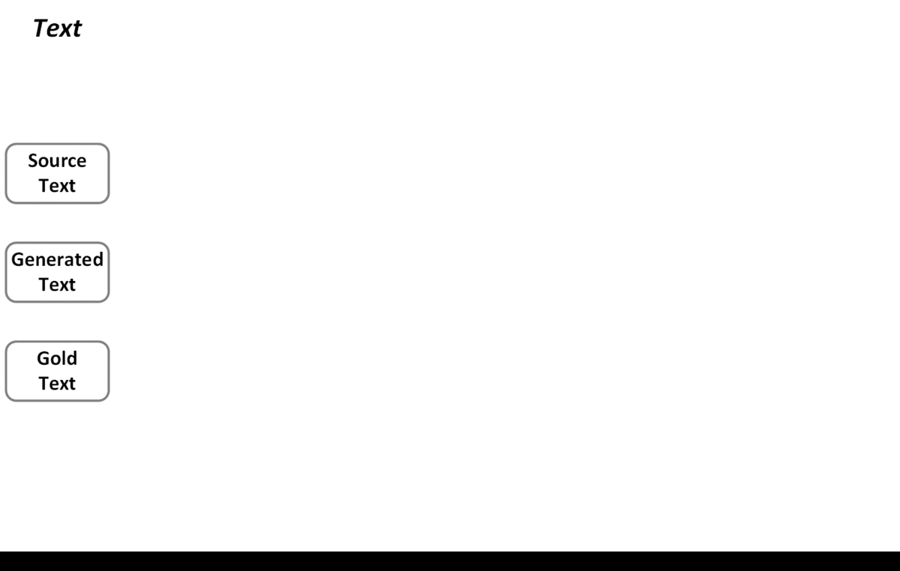

# REALSumm: Re-evaluating EvALuation in Summarization





## Collected System summaries

| SNo. | Model | Paper | Variant | Type |
| ---- | ----- | ----- | ------- | ---- |
| 1 | HeterGraph | [Want et al., 2020](https://arxiv.org/abs/2004.12393) | default | Extractive |
| 2 | MatchSumm | [Zhong et al., 2020](https://arxiv.org/abs/2004.08795) | default | Extractive |
| 3 | PNBERT | [Zhong et al., 2020](https://www.aclweb.org/anthology/P19-1100/) | BERT-LSTM-PN-RL | Extractive |
| 4 | PNBERT | [Zhong et al., 2020](https://www.aclweb.org/anthology/P19-1100/) | BERT-LSTM-PN | Extractive |
| 5 | PNBERT | [Zhong et al., 2020](https://www.aclweb.org/anthology/P19-1100/) | BERT-LSTM-SL | Extractive |
| 6 | PNBERT | [Zhong et al., 2020](https://www.aclweb.org/anthology/P19-1100/) | BERT-TF-PN | Extractive |
| 7 | PNBERT | [Zhong et al., 2020](https://www.aclweb.org/anthology/P19-1100/) | BERT-TF-SL | Extractive |
| 8 | PNBERT | [Zhong et al., 2020](https://www.aclweb.org/anthology/P19-1100/) | LSTM-PN-RL | Extractive |
| 9 | PNBERT | [Zhong et al., 2020](https://www.aclweb.org/anthology/P19-1100/) | LSTM-PN | Extractive |
| 10 | PNBERT | [Zhong et al., 2020](https://www.aclweb.org/anthology/P19-1100/) | LSTM-SL | Extractive |
| 11 | PNBERT | [Zhong et al., 2020](https://www.aclweb.org/anthology/P19-1100/) | TF-PN | Extractive |
| 12 | PNBERT | [Zhong et al., 2020](https://www.aclweb.org/anthology/P19-1100/) | TF-SL | Extractive |
| 13 | BART | [Lewis et al., 2019](https://arxiv.org/abs/1910.13461) | Ext | Extractive |
| 14 | REFRESH | [Narayan et al., 2018](https://www.aclweb.org/anthology/N18-1158/) | default | Extractive |
| 15 | NeuSumm | [Zhou et al., 2018](https://www.aclweb.org/anthology/P18-1061/) | default | Extractive|
| 16 | BanditSumm | [Dont et al., 2018](https://www.aclweb.org/anthology/D18-1409/) | default | Extractive |
| 17 | SemSim | [Yoon et al., 2020](https://arxiv.org/abs/2002.07767) | default | Abstractive|
| 18 | BART | [Lewis et al., 2019](https://arxiv.org/abs/1910.13461) | Abs | Abstractive |
| 19 | PreSumm | [Liu et al., 2019](https://www.aclweb.org/anthology/D19-1387/) | Abs | Abstractive|
| 20 | PreSumm | [Liu et al., 2019](https://www.aclweb.org/anthology/D19-1387/) | Ext-Abs | Abstractive|
| 21 | PreSumm | [Liu et al., 2019](https://www.aclweb.org/anthology/D19-1387/) | Trans-Abs | Abstractive|
| 22 | TwoStageRL | [Zhang et al., 2019](https://arxiv.org/abs/1902.09243) | default | Abstractive|
| 23 | UniLM | [Dong et al., 2019](https://papers.nips.cc/paper/9464-unified-language-model-pre-training-for-natural-language-understanding-and-generation) | V1 | Abstractive|
| 24 | UniLM | [Dong et al., 2019](https://papers.nips.cc/paper/9464-unified-language-model-pre-training-for-natural-language-understanding-and-generation) | V2 | Abstractive|
| 25 | T5 | [Raffel et al., 2019](https://arxiv.org/abs/1910.10683) | base | Abstractive|
| 26 | T5 | [Raffel et al., 2019](https://arxiv.org/abs/1910.10683) | small | Abstractive|
| 27 | T5 | [Raffel et al., 2019](https://arxiv.org/abs/1910.10683) | large | Abstractive|
| 28 | T5 | [Raffel et al., 2019](https://arxiv.org/abs/1910.10683) | 3B | Abstractive|
| 29 | T5 | [Raffel et al., 2019](https://arxiv.org/abs/1910.10683) | 11B | Abstractive|
| 30 | BottomUp | [Gehrmann et al., 2018](https://www.aclweb.org/anthology/D18-1443/) | default | Abstractive|
| 31 | FastAbsRL | [Chen et al., 2018](https://www.aclweb.org/anthology/P18-1063/) | default | Abstractive|
| 32 | FastAbsRL | [Chen et al., 2018](https://www.aclweb.org/anthology/P18-1063/) | Rerank | Abstractive|
| 33 | PtrGen | [See et al., 2017](https://www.aclweb.org/anthology/P17-1099/) | baseline | Abstractive|
| 34 | PtrGen | [See et al., 2017](https://www.aclweb.org/anthology/P17-1099/) | ptr-gen | Abstractive|
| 35 | PtrGen | [See et al., 2017](https://www.aclweb.org/anthology/P17-1099/) | ptr-gen-cov | Abstractive|

There are total 35 system outputs, 16 extractive and 19 abstractive.
- [Aligned outputs used for scoring](https://drive.google.com/file/d/1z9WGs-mC7JO8U5PgEYE_SrekST7nC64x/view?usp=sharing)
- [Aligned ouputs used for human evaluation](https://drive.google.com/file/d/1z9WGs-mC7JO8U5PgEYE_SrekST7nC64x/view?usp=sharing)

Please read our [reproducibility instructions](https://github.com/neulab/REALSumm/blob/master/reproducibility.md) in addition to
our paper (TODO: add link) in order to reproduce this work for another dataset.

# Meta-evaluate a new metric on CNN/DM
## I can score all the given summaries 
1. Just give a scores dict in the below format. Make sure to include ``litepyramid_recall``, which is the metric used by human evaluators, in the scores dict.
2. Run [the analysis notebook](https://github.com/neulab/REALSumm/blob/master/analysis/analysis.ipynb) on the scores dict to get all the graphs and tables used in the paper.

## Help me score the given summaries
1. Update ``scorer.py`` such that (1) if there is any setup required by your metric, make sure to do it in the ``__init__`` function of scorere as the scorere will be used to score all systems. And (2) add your metric in the ``score`` function as
```python
elif self.metric == "name_of_my_new_metric":
  scores = call_to_my_function_which_gives_scores(passing_appropriate_arguments)
```

where ``scores`` is a list of scores corresponding to each summary in a file. It should be a list of dictionaries e.g. ``[{'precision': 0.0, 'recall': 1.0} ...]``


2. Calculate the scores and the scores dict using ``python get_scores.py --data_path ../selected_docs_for_human_eval/<abs or ext> --output_path ../score_dicts/abs_new_metric.pkl --log_path ../logs/scores.log -n_jobs 1 --metric <name of metric> ``
3. Your scores dict is generated at the output path.
4. Merge it with the scores dict with human scores provided in ``scores_dicts/`` using ``python score_dict_update.py --in_path <score dicts folder with the dicts to merge> --out_path <output path to place the merged dict pickle> -action merge``
5. Your dict will be merged with the one with human scores and the output will be placed in ``out_path``. You can now run the analysis notebook on the scores dict to get all the graphs and tables

## Scores dict format used


    {
        doc_id: {
                'doc_id': value of doc id,
                'ref_summ': reference summary of this doc,
                'system_summaries': {
                    system_name: {
                            'system_summary': the generated summary,
                            'scores': {
                                'js-2': the actual score,
                                'rouge_l_f_score': the actual score,
                                'rouge_1_f_score': the actual score,
                                'rouge_2_f_score': the actual score,
                                'bert_f_score': the actual score
                            }
                    }
                }
            }
    }
    


